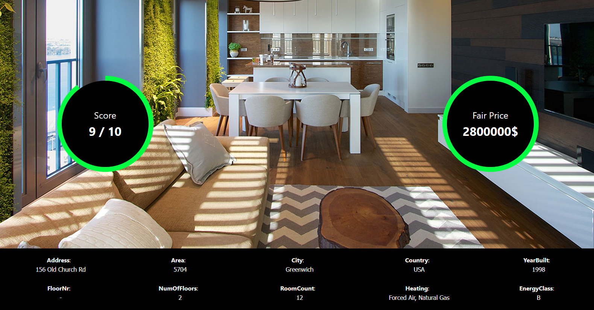

# 🏡 HomeIntel

## 🏠 Team Information

- **Team Name:** HomeIntel  
- **Members:**  
  - Jonas Urnėžius  
  - Aronas Butkevičius  
  - Ernest Tretjakev  
  - Ignas Tautvaišas  

## 📌 Project Overview

Our objective is to develop a web application that analyzes real estate listings and returns a fair market price and evaluation score using AI-driven techniques. The system supports links from platforms such as **Aruodas** and **Zillow**, and generates intelligent, data-backed property assessments.

## ✨ Features

- 🔗 **URL-Based Input**  
  Fetches real estate data automatically from Aruodas or Zillow URLs.

- 🧠 **AI-Powered Evaluation**  
  Evaluates property value and quality using machine learning techniques with `com.google.gson.*` for JSON parsing.

- 🎯 **Priority Selection**  
  Users can prioritize different aspects of a property using a color-coded system (Red = not important, Green = very important).

- 📝 **Editable Property Fields**  
  All property data is editable, enabling tailored evaluations based on user knowledge.

- 📊 **Visual Evaluation Indicator**  
  Displays a circular indicator to show the overall property score using color gradients from green to red.

- 🔁 **Real-Time Reevaluation**  
  Updates results when any field is changed or additional information is provided.

## 🚀 How to Use the Website

1. On the homepage, paste a valid real estate listing URL from Aruodas or Zillow, **or** switch to the prompt section to manually enter property details.
2. Click the **green arrow button** to proceed.
3. Select your evaluation priorities across various categories (color-coded as follows):  
   - 🟥 **Red** – Not important  
   - 🟨 **Yellow** – Neutral  
   - 🟩 **Green** – Important  
4. Click the button again to submit your choices.
5. The result page will display:
   - **Top Left:** AI-generated evaluation score  
   - **Top Right:** Estimated fair price  
   - A colored indicator ring showing the overall evaluation (green = good, red = poor)
6. In the center section, you'll find detailed property information. These fields are editable.
7. If you make any changes or provide additional information, simply click the button again to **recalculate the score** based on updated data.

## 🏗 Testing table
| Action / Test Step                                    | Expected Outcome                        | Actual Outcome (Screenshot)            |
|-------------------------------------------------------|------------------------------------------|----------------------------------------|
| User enters prompt and presses evaluate               | The program evaluates the prompt and shows results |  |
| User enters new data and presses reevaluate           | The program evaluates the new data and shows updated results |  |
| User presses home button after evaluation             | The program navigates to the home screen |  |
| User presses the logo                                  | The program redirects to the home screen |  |
| User presses one of the navbar options                | The program navigates to the selected page |  |
| User enters an invalid prompt                         | The program displays an error message |  |

## 🧰 Requirements

Ensure the following tools are installed:

- Java 17+
- Node.js & npm (v16+ recommended)
- Maven
- Internet connection
- IDE such as IntelliJ IDEA or VS Code

## 🔧 Installation & Setup

### 1. Clone the Repository
```sh
git clone https://github.com/JonasUrn/HomeIntel.git
cd HomeIntel
```

### 2. Intstall frontend part
```sh
cd frontend
npm install
```

### 3. Create or Switch to a Branch
```sh
git checkout -b [branch_name]
```

### 4. Create .env file
In ./HomenIntel path create .env file
Insert one line:
```sh
API_HOME_INTEL=[GEMINI_API_KEY]
```
Where GEMINI_API_KEY is your API key from https://aistudio.google.com/apikey

Save it

### 5. Add and Commit Changes
```sh
git add --all
git commit -m "[Your commit message]"
```

### 6. Push Changes
```sh
git push -u origin [branch_name]
```

## ▶️ Running the Project

### 1. Start the Frontend
```sh
cd frontend
npm start
```

### 2. Start the Backend
Open your IDE and run the following class:
```
src/main/java/com/homeintel/MainApplication.java
```

This will launch the Spring Boot backend server.

## 🚧 React Development Rules

To maintain code consistency and scalability, follow these frontend coding conventions:

- Use **arrow functions**:  
  `const myFunction = () => {};`

- **Use CSS Modules only**:  
  - File naming: `ComponentName.module.css`  
  - Usage:  
    ```js
    import styles from './ComponentName.module.css';
    <div className={styles.exampleClass}></div>
    ```  
  - More info: https://create-react-app.dev/docs/adding-a-css-modules-stylesheet/

- Each **component must be in its own file**  
- Group related components in their **own folders**

## 🛠️ Git Workflow Rules

- Create a **new branch** for each feature/task.
- Branch naming format:  
  `[Initials]-[feature-name]`  
  Example: `JU-create-header` (JU = Jonas Urnėžius)
- Do development on that branch.
- Push branch to GitHub.
- Open a **Pull Request** and assign a reviewer.
- Each small task has its own branch!

## 🤝 Contribution

1. Fork the repository  
2. Create a feature branch  
3. Commit your changes  
4. Push to your fork  
5. Submit a pull request and assign a reviewer

## 📬 Contact

Have questions or feedback?  
Submit an issue via [GitHub Issues](https://github.com/JonasUrn/HomeIntel/issues)

## 📄 License
MIT License

Copyright (c) 2025 HomeIntel

Permission is hereby granted, free of charge, to any person obtaining a copy of this software and associated documentation files (the "Software"), to deal in the Software without restriction, including without limitation the rights to use, copy, modify, merge, publish, distribute, sublicense, and/or sell copies of the Software, and to permit persons to whom the Software is furnished to do so, subject to the following conditions:

The above copyright notice and this permission notice shall be included in all copies or substantial portions of the Software.

THE SOFTWARE IS PROVIDED "AS IS", WITHOUT WARRANTY OF ANY KIND, EXPRESS OR IMPLIED, INCLUDING BUT NOT LIMITED TO THE WARRANTIES OF MERCHANTABILITY, FITNESS FOR A PARTICULAR PURPOSE AND NONINFRINGEMENT. IN NO EVENT SHALL THE AUTHORS OR COPYRIGHT HOLDERS BE LIABLE FOR ANY CLAIM, DAMAGES OR OTHER LIABILITY, WHETHER IN AN ACTION OF CONTRACT, TORT OR OTHERWISE, ARISING FROM, OUT OF OR IN CONNECTION WITH THE SOFTWARE OR THE USE OR OTHER DEALINGS IN THE SOFTWARE.
